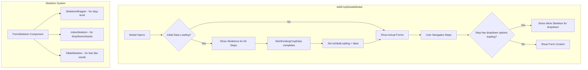

# Loading Skeleton Implementation Plan

## Problem Statement

When `AddCropDetailsModal` opens, the forms render immediately with empty data, then populate suddenly when the API call completes. This creates a poor UX with visible data loading delays.

## Solution Overview

Implement **step-level skeleton loaders** using the existing `Skeleton` component to show form placeholders while data is being fetched.

## Architecture Diagram



## Current State Analysis

### Existing Loading State
- `isLoading`: Used only for form submission (lines 40, 185)
- No tracking for initial data fetch

### Forms Structure
1. **SeedDetails** - Array-based list with dynamic rows
2. **IrrigationCultivation** - Multiple dropdowns + input fields
3. **History** - Multiple input fields
4. **Weather** - Dropdowns + remarks textarea
5. **PestsDisease** - Multi-select + additional fields
6. **Chemicals** - Tabbed interface with lists
7. **AttachmentStepOne** - File upload interface
8. **CropDetailsPreview** - Read-only summary

## Implementation Steps

### Step 1: Add Loading State Tracking

**File:** `components/AddCropDetailsModal.tsx`

```typescript
// Add new state at line 40
const [isInitialLoading, setIsInitialLoading] = useState(true);

// Update useEffect (around line 66)
useEffect(() => {
  const fetchExistingCropData = async () => {
    if (!cropId) return;
    
    setIsInitialLoading(true); // ← Add this
    try {
      // ... existing API call ...
    } catch (err) {
      console.error("❌ Failed to fetch crop data:", err);
    } finally {
      setIsInitialLoading(false); // ← Add this
    }
  };
  
  fetchExistingCropData();
}, [cropId]);
```

### Step 2: Create Reusable Skeleton Components

**New File:** `components/ui/form-skeleton.tsx`

```typescript
import { Skeleton } from "./skeleton";

export function FormSkeleton({ type = "default" }) {
  switch (type) {
    case "form-with-dropdowns":
      return <DropdownFormSkeleton />;
    case "list-form":
      return <ListFormSkeleton />;
    case "input-form":
      return <InputFormSkeleton />;
    default:
      return <DefaultFormSkeleton />;
  }
}

function DefaultFormSkeleton() {
  return (
    <div className="space-y-4">
      <Skeleton className="h-4 w-1/4" />
      <Skeleton className="h-10 w-full" />
      <Skeleton className="h-10 w-full" />
      <Skeleton className="h-20 w-full" />
    </div>
  );
}

function DropdownFormSkeleton() {
  return (
    <div className="space-y-4">
      <Skeleton className="h-4 w-1/4" />
      <Skeleton className="h-10 w-full" />
      <Skeleton className="h-10 w-full" />
      <Skeleton className="h-10 w-full" />
      <Skeleton className="h-10 w-full" />
    </div>
  );
}

function ListFormSkeleton() {
  return (
    <div className="space-y-4">
      <Skeleton className="h-4 w-1/4" />
      <Skeleton className="h-16 w-full" />
      <Skeleton className="h-16 w-full" />
      <Skeleton className="h-10 w-1/3" />
    </div>
  );
}

function InputFormSkeleton() {
  return (
    <div className="space-y-4">
      <Skeleton className="h-4 w-1/4" />
      <Skeleton className="h-10 w-full" />
      <Skeleton className="h-10 w-full" />
      <Skeleton className="h-10 w-full" />
      <Skeleton className="h-10 w-full" />
      <Skeleton className="h-20 w-full" />
    </div>
  );
}
```

### Step 3: Update renderStep() with Loading States

**File:** `components/AddCropDetailsModal.tsx`

```typescript
const renderStep = () => {
  // Show skeleton for all steps during initial load
  if (isInitialLoading) {
    return <FormSkeleton type="form-with-dropdowns" />;
  }
  
  switch (currentStep) {
    case 0:
      return <CropDetailsForm ... />;
    case 1:
      return <IrrigationCultivation ... />;
    // ... rest of cases
  }
};
```

### Step 4: Add Inline Loading for Dropdowns (Optional Enhancement)

For forms that load their own dropdown options, add inline skeletons:

**In individual form components:**
```typescript
// Example: IrrigationCultivation.tsx
const [isLoadingOptions, setIsLoadingOptions] = useState(true);

// After all option fetches complete:
setIsLoadingOptions(false);

// In JSX:
{isLoadingOptions ? (
  <DropdownFormSkeleton />
) : (
  <DropdownField ... />
)}
```

## Component Mapping

| Step | Form Component | Skeleton Type |
|------|----------------|---------------|
| 0 | CropDetailsForm | list-form |
| 1 | IrrigationCultivation | form-with-dropdowns |
| 2 | History | input-form |
| 3 | Weather | form-with-dropdowns |
| 4 | PestsDisease | form-with-dropdowns |
| 5 | Chemicals | list-form |
| 6 | AttachmentStepOne | default |
| 7 | CropDetailsPreview | default |

## Alternative Approaches Considered

### Option 1: Single Global Spinner
- ✅ Simple to implement
- ❌ Blocks entire UI, less informative

### Option 2: Per-Field React Suspense
- ✅ Granular loading states
- ❌ Requires significant refactor to use Suspense boundaries

### Option 3: Step-Level Skeletons (Recommended)
- ✅ Shows expected form structure
- ✅ Non-blocking, maintains layout
- ✅ Scales with new forms
- ✅ Existing Skeleton component available

## Files to Modify

1. `components/AddCropDetailsModal.tsx` - Add loading state, update renderStep()
2. `components/ui/form-skeleton.tsx` - **Create new**
3. Individual form components - **Optional** inline loading for dropdowns

## Success Criteria

- [ ] Modal shows skeletons on initial open
- [ ] Skeletons match expected form dimensions
- [ ] Forms appear immediately after data loads
- [ ] No layout shift when data populates
- [ ] Loading feels smooth and responsive

## Estimated Complexity

- **Low** - Primarily copy-paste skeleton patterns
- **Medium** - Customizing skeletons for each form type
